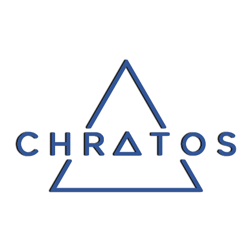

    

### What is Chratos?

---

Chratos's goal is to become _"a global currency with instantaneous transactions and zero fees over a secure, decentralized network."_

We've applied the philosophy of _"do one thing and do it well."_ We are focused on building the best medium for value exchange in the world.

---

### Key Features

* Chratos utilizes a novel [block-lattice](https://github.com/nanocurrency/raiblocks/wiki/Block-lattice) architecture, unlike conventional blockchains used in many other cryptocurrencies.
* The network requires minimal resources, no high-power mining hardware, and can process high transaction throughput.
* Offers instantaneous transactions with zero fees and unlimited scalability, making Nano an ideal solution for peer-to-peer transactions.

For more information, see [Chratos.org](https://nano.org/) or read the [whitepaper](https://nano.org/en/whitepaper).

### Guides & Documentation

* [Whitepaper](https://nano.org/en/whitepaper)
* [Build Instructions](https://github.com/nanocurrency/raiblocks/wiki/Build-Instructions)
* [Command Line Interface](https://github.com/nanocurrency/raiblocks/wiki/Command-line-interface)
* [RPC Protocol](https://github.com/nanocurrency/raiblocks/wiki/RPC-protocol)
* [Wallet Design](https://github.com/nanocurrency/raiblocks/wiki/Wallet-design)
* [Block-Lattice](https://github.com/nanocurrency/raiblocks/wiki/Block-lattice)
* [Design Features](https://github.com/nanocurrency/raiblocks/wiki/Design-features)

### Links & Resources

* [Chratos Website](https://nano.org)
* [Chratos Roadmap](https://developers.nano.org/roadmap)
* [Discord Chat](https://chat.nano.org/)
* [Reddit](https://reddit.com/r/nanocurrency)
* [Medium](https://medium.com/nanocurrency)
* [Twitter](https://twitter.com/nano)
* [Forum](https://forum.raiblocks.net/)
* [GitHub wiki](https://github.com/nanocurrency/raiblocks/wiki)

### Want to Contribute?

Please see the [contributors guide](https://github.com/nanocurrency/raiblocks/wiki/Contributing).

### Contact us

We want to hear about any trouble, success, delight, or pain you experience when
using Chratos. Let us know by [filing an issue](https://github.com/chratos-system/chratos/issues), joining us in [reddit](https://reddit.com/r/nanocurrency), or joining us in [Discord](https://chat.nano.org/).
